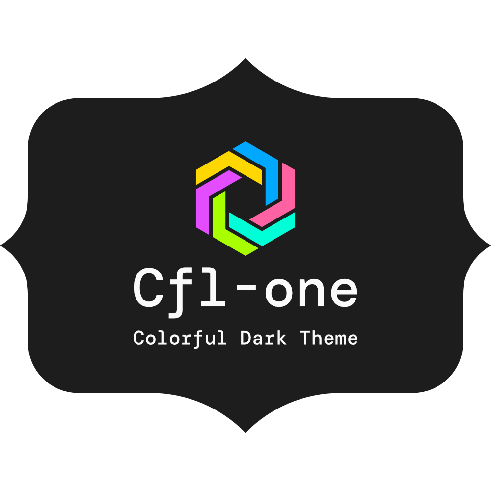
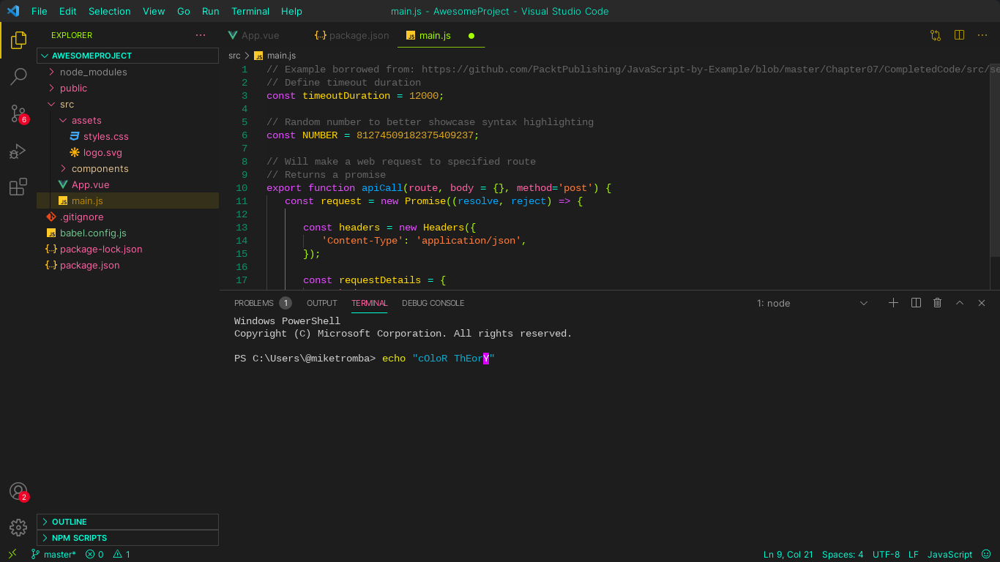
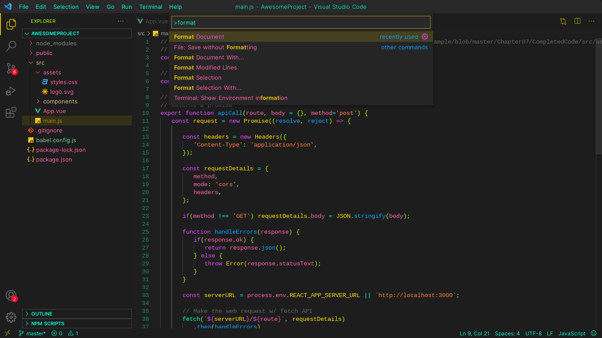
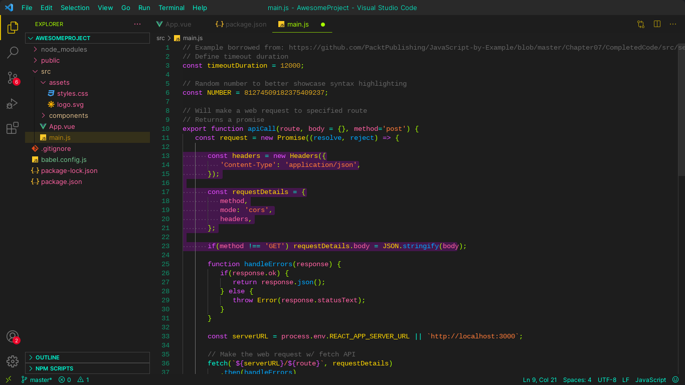

# Colorful-one (VSCode theme)

## Description

This theme is very colorful, all the colors are derived from the HTML color name\
Gold | #ffd700\
*More detailed info soon…*

## Images

 

 

---
*
Enjoy!
*
